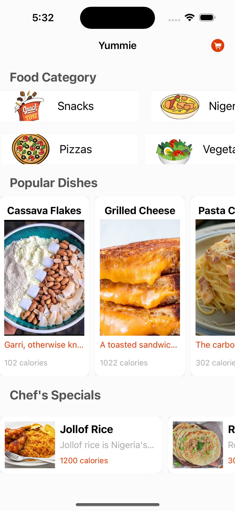
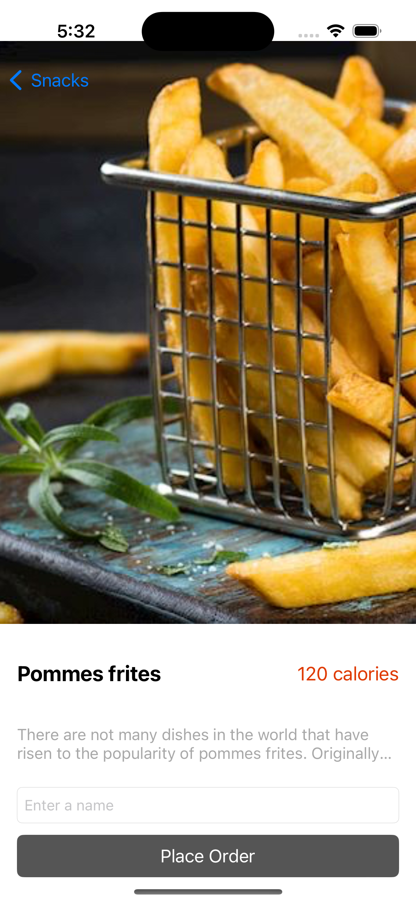
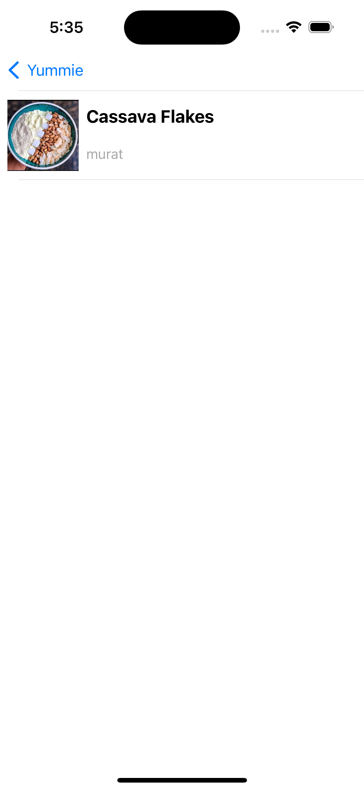
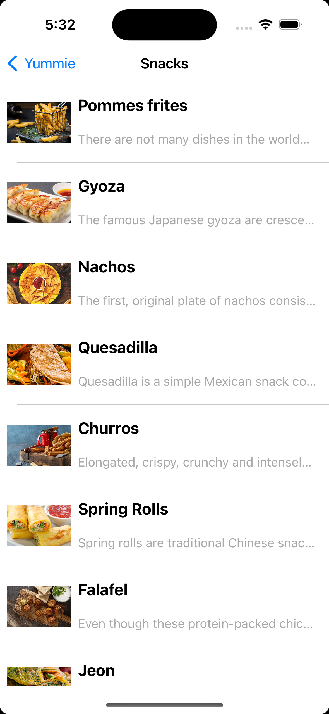
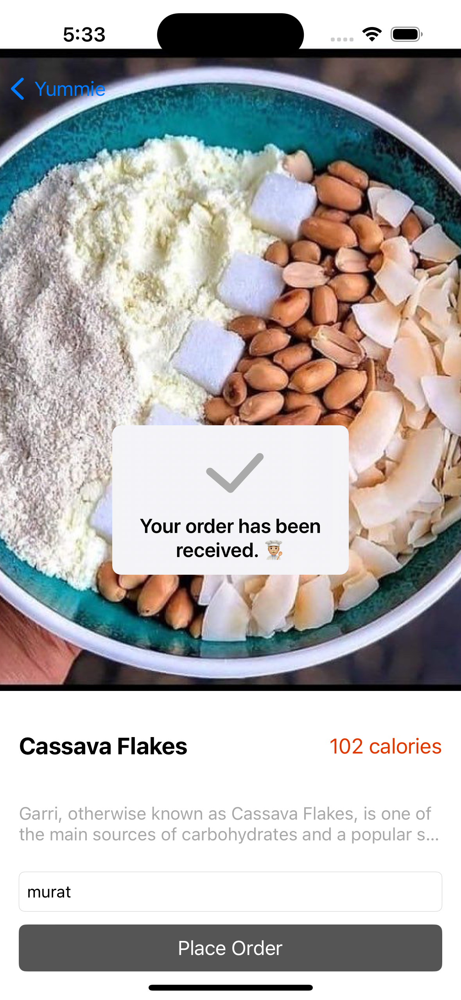
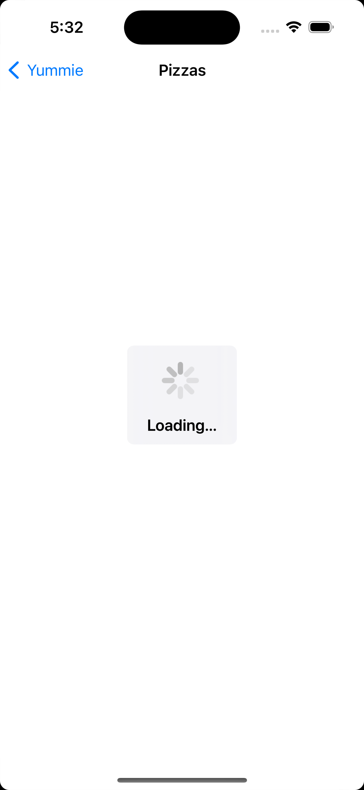

# Yummie App

This app actually food ordering app . You can see chefs special foods , category list , order a food. I used uikit and swift language.

## Technologies
- Swift
- XCode
- UIKit
- Kingfisher
- ProgressHUD
- IQKeyboardManagerSwift

## Screenshots

## Home ##

  

## Dish Detail ##

  

## Order List ##

  

## Category List ##

  

## Other Screens ##

  
  

## Installation

1. Clone this repository.
2. Run `pod install`.
3. Open `YummieApp.xcworkspace` in Xcode.
4. Run the project.

## Contributing

If you would like to contribute, please open an issue first and associate your changes with that issue.
## License

This project is licensed under the MIT License. See the `LICENSE` file for more information.

## Resources
Emmanuel Okwara Youtube Channel
https://www.youtube.com/watch?v=He6pfuCZUGk&list=PLgBVHL8joMCthoqCwsWAUWIiyJaPrqPA4

